## Задачи без *
### Прописал статические маршруты:
Роутер r1:\
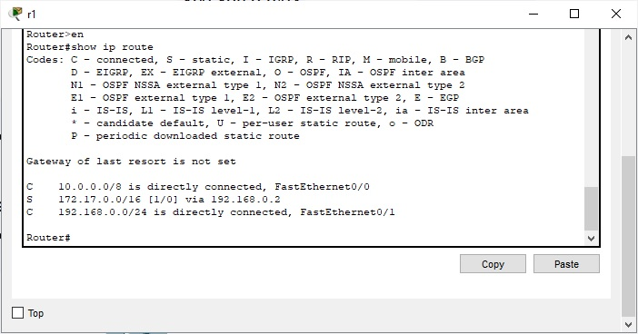\
Роутер r2:\
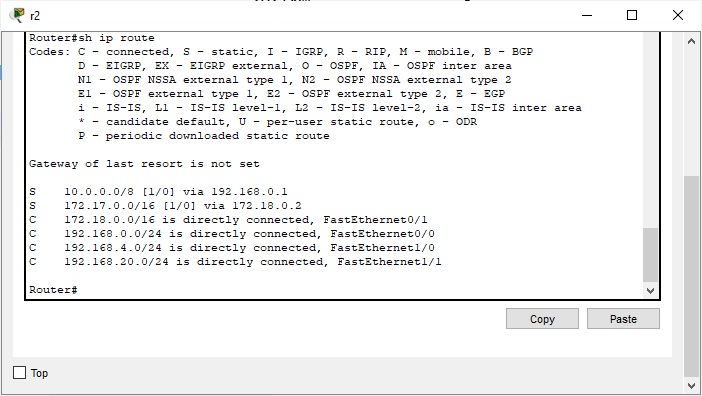\
Роутер r3:\
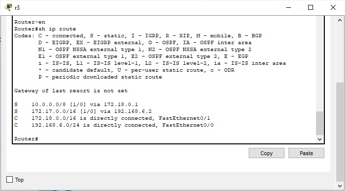\
Роутер r4:\
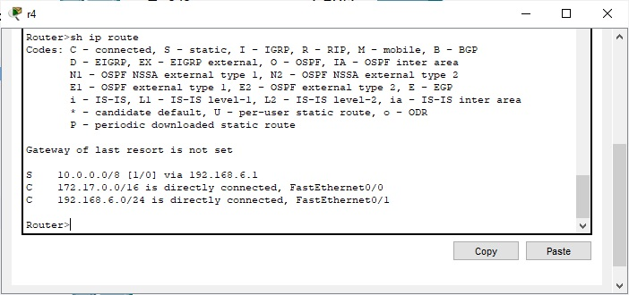\
Ping 10.0.0.10 -> 172.17.255.132:\
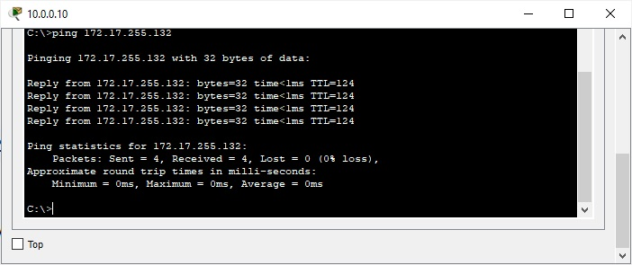\
Ping 10.0.0.11 -> 172.17.255.132:\
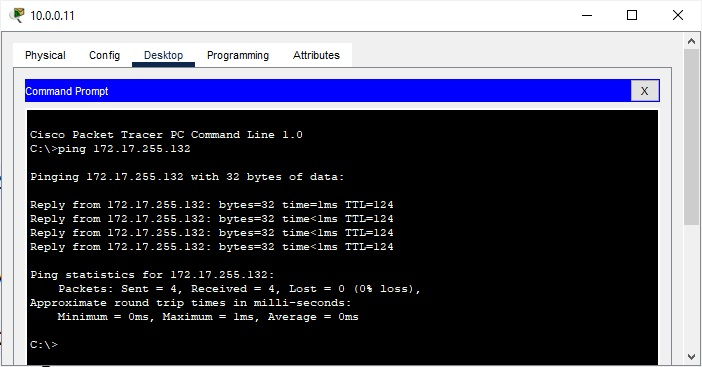\
Ping 172.17.255.132 -> 10.0.0.10 & 172.17.255.132 -> 10.0.0.11:\
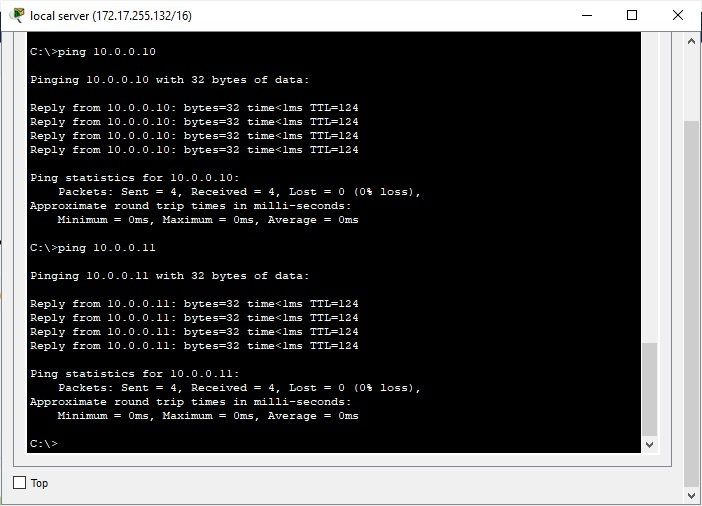\
Tracert 10.0.0.10 -> 172.17.255.132:\
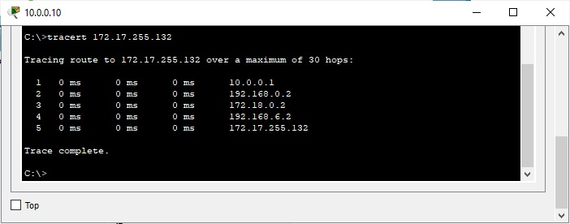\
Tracert 10.0.0.11 -> 172.17.255.132:\
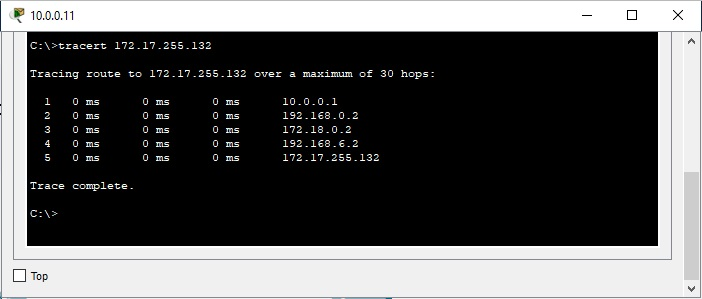\

## Задачи *
Роутер r1:\
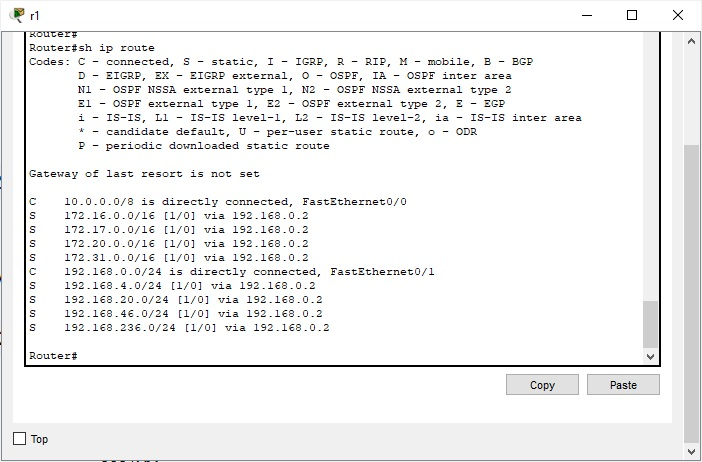\
Роутер r2:\
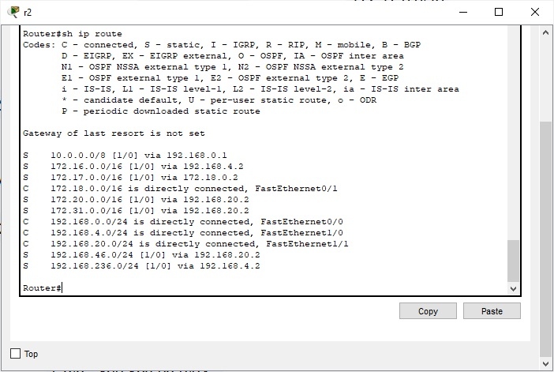\
Роутер r3:\
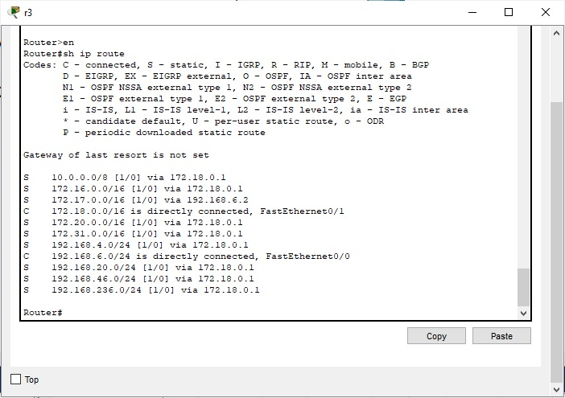\
Роутер r4:\
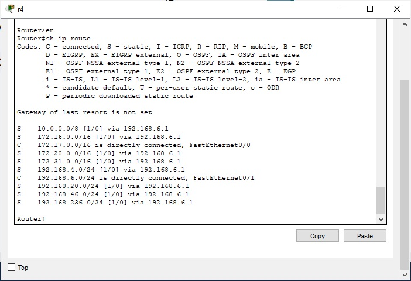\
Роутер r5:\
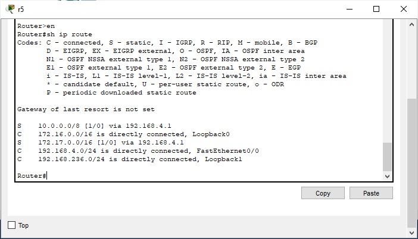\
Роутер r6:\
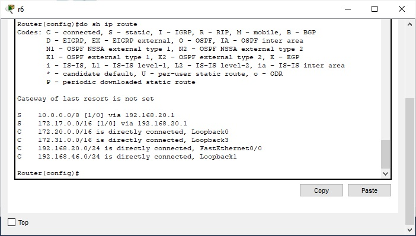\
Ping с сервера (fa 0/0 r5 и loop back): \
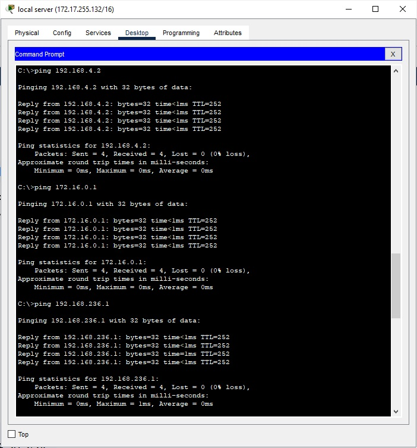\
Ping с сервера (fa 0/0 r6 и loop back):\
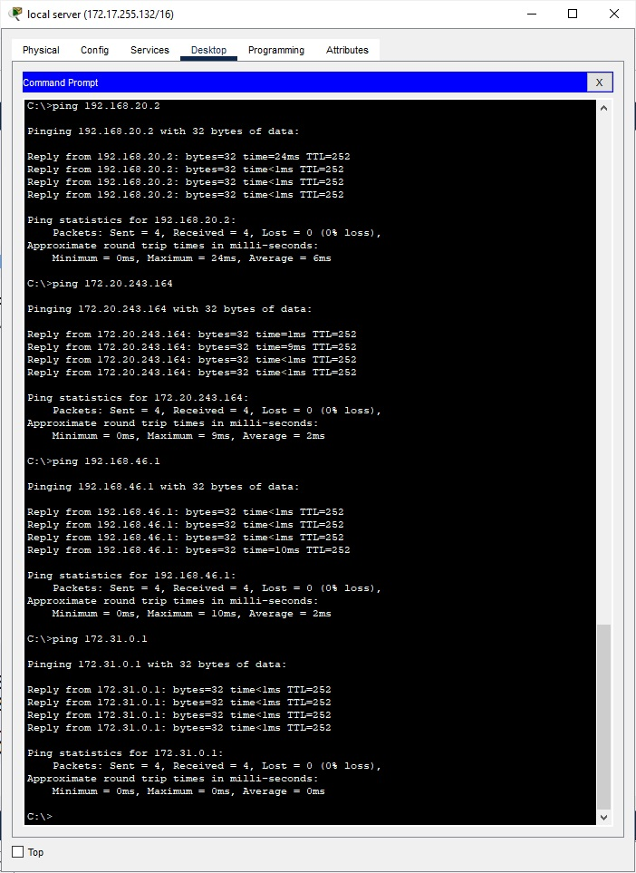\
Tracert с PC 10.0.0.10:\
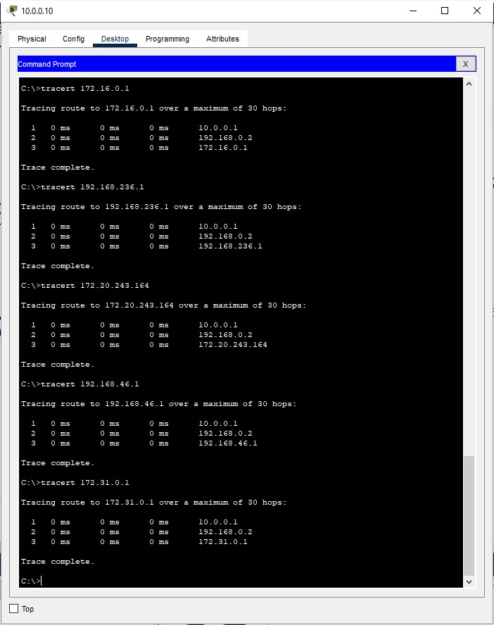\

